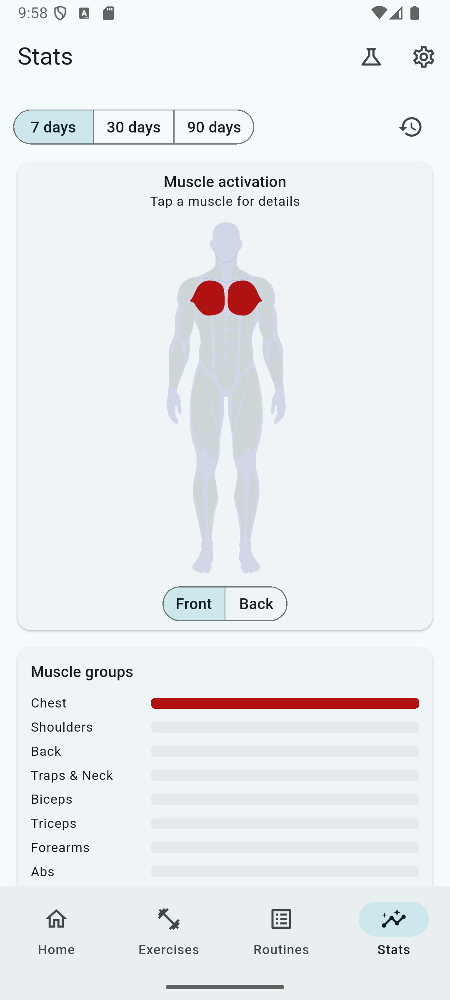
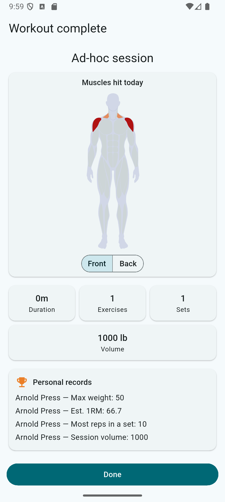
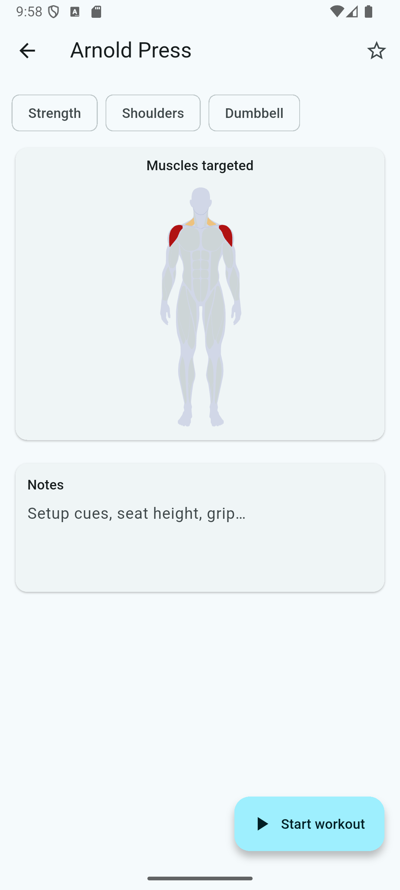

# FitnessBuddy 🏋️

**An open-source, offline-first workout tracker for Flutter with an
interactive muscle heatmap.**

Log workouts, build routines, track personal records — and *see* your
training as an anatomically accurate body heatmap that lights up the muscles
you've worked, powered by a
[Rive muscle heatmap asset](https://fitnessvisuals.com) with 29 individually
addressable muscles, tap-to-drill-down interactivity, and male/female ×
front/back views.

| Muscle activation | Workout summary | Exercise detail |
|---|---|---|
|  |  |  |

## Features

- 🔥 **Interactive muscle heatmap** — weekly activation on the dashboard,
  "muscles hit today" after every workout, per-exercise muscle previews, and
  a date-range Stats view where **tapping a muscle** opens its training
  trend, contributing exercises, and a filtered jump into the catalog.
- 📚 **195-exercise catalog** — strength & cardio, 10+ modalities, body-part
  and free-text filtering, favorites, notes, plus custom exercises.
- 📋 **Routines** — reorderable builder, duplication, per-slot notes. No
  planned sets: each session pre-fills from your last performance.
- 🏃 **Live workout tracking** — modality-aware set forms (weight×reps,
  reps, duration, distance+time with derived speed), rest timers, and
  crash-safe draft autosave with resume.
- 📈 **Analytics** — per-exercise progress charts (volume, est. 1RM, and
  more), personal-record feed, full workout history. Charts read
  pre-computed daily rollups, never raw logs.
- 📴 **100% offline** — SQLite is the single source of truth. No account,
  no network, no telemetry.

## The muscle heatmap

The heatmap is driven by the **Human Anatomy Advanced** Rive asset from
[Fitness Visuals](https://fitnessvisuals.com). It's a commercial asset and
is **not included in this repository** — but the app fully works without it:
every heatmap surface falls back to the same data rendered as muscle-group
heat bars.

To enable the interactive figure:

1. Get `human_anatomy_advanced_v3.0.riv` from
   [fitnessvisuals.com](https://fitnessvisuals.com)
2. Drop it into `assets/rive/`
3. Rebuild — it activates automatically

Under the hood, the app maps its 17-value body-part taxonomy onto the
asset's 29 muscles through a weighted mapping table, normalizes training
volume into 0–4 heat intensities (relative scaling + √ compression so
secondary muscles stay visible), and drives the asset through Rive's data
binding API — see
[`lib/features/heatmap/`](lib/features/heatmap).

## Getting started

```bash
git clone https://github.com/jorgeg922/fitness_buddy.git
cd fitness_buddy
flutter pub get
dart run build_runner build --force-jit   # drift codegen
flutter run
```

Requires Flutter 3.28+ / Dart 3.10+. Android and iOS.

## Architecture

Offline-first: **the database is the app.** Every write lands in SQLite
synchronously; every list is a reactive stream over a SQLite query.

```
Widget (ConsumerWidget)
   ▼ ref.watch / ref.read
Riverpod providers                 hand-written, no codegen
   ▼
Use case                           validate → map → convert units → persist
   ▼                               returns Result<T>
Repository                         read (streams) / write (transactions) split
   ▼
Drift DAO → SQLite                 type-safe queries, reactive watch*
```

Highlights worth stealing:

- **Modality capability matrix** — each exercise modality declares which
  metrics it tracks, which can PR, and which are chartable. Adding a
  modality never changes the schema.
- **Finish pipeline** — ending a workout runs pure computation (stats
  rollups, PR detection, muscle usage) and persists everything in a single
  transaction; a failure anywhere leaves the draft resumable.
- **Imperial-only storage** — one canonical unit system in the DB,
  conversion at the edges; flipping units rebuilds the provider graph and
  the whole UI re-renders converted.
- **Crash-safe drafts** — live sets autosave (debounced 500 ms) into a
  draft table that's separate from history; the home screen offers resume.

## Contributing

PRs welcome — see [CONTRIBUTING.md](CONTRIBUTING.md). `flutter analyze`
clean and `flutter test` green, please.

## License

[MIT](LICENSE). The Rive muscle heatmap asset is a commercial product of
[Fitness Visuals](https://fitnessvisuals.com) and is licensed separately.
